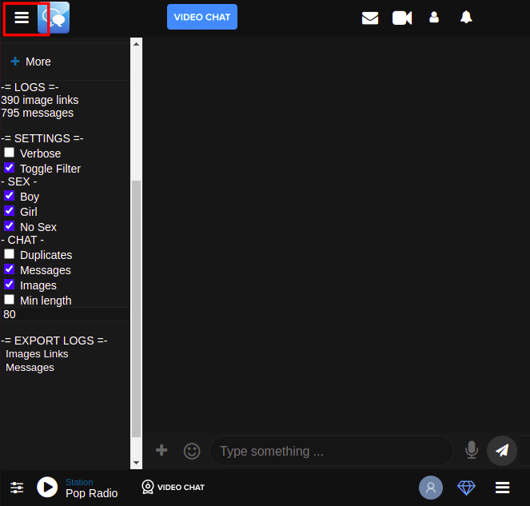
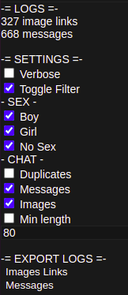
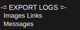

# ChatAF
ChatAF (Chat Avenue Filter) is a userscript for different chats listed on chat-avenue.com specifically this is only tested and developed for full chat versions (the chat window is not embedded in a frame) and specifically for the adult chat https://www.chat-avenue.com/adult/.

## Installation
Using [Tempermonkey](https://www.tampermonkey.net/) or your preffered user script manager you can install the [script.user.js](./script.user.js) by opening the [raw](./script.user.js?raw=1) and it will propt to install it. 

You can also paste the content of [script.user.js](./script.user.js) into your console when at the site although would be required at every refresh.

## Usage
On the left hand side in the collapsable menu showing the links to the friends wall and news buttons the filter menu will be displayed. The options can be seen in the figure below.

By default everything is checked meaning the filter allows everything to be passed through and displayed. For example: if "Boy" is unchecked then all messages from users with gender "Boy" set will be removed/caught by the filter.

## Logging
The logging is considering the filters so if "Boy" is unchecked no messages nor images from users with gender "Boy" will be logged. The images are logged using links to the images posted. Note is that these images are temporary hosted and will dissapear after 24 hours. Therefor logging over 24 hours would contain a lot of link leading for a 404.

The links to the images or messages can be downloaded to csv files by pressing the "Images links" or "Messages" text under the "EXPORT LOGS" section. The image links csv file can then be processed to download all the images. It will also filter out the duplicates since this is not done by the filter even if the duplicates filter is unchecked. The logs are wiped if the page is refreshed.
